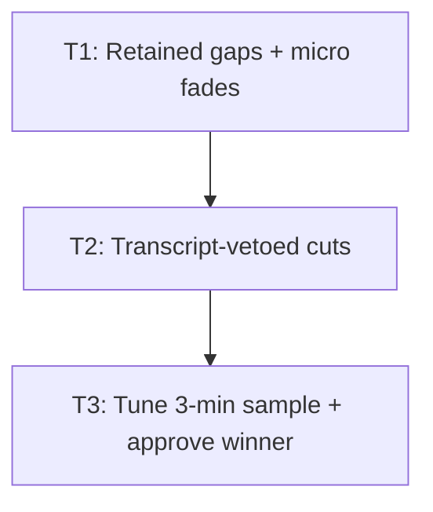

# Plan: Transcript-safe silence-cut tuning

## Goal

Tune first 3:00 of `/mnt/data/Videos/OBS_Output/2026-08-02 17-38-52.mp4`. Produce one user-approved dynamic sample: 300 ms retained gaps, no clipped words, hard video cuts, 8 ms audio fades. Deliver exact settings + transcript comparison. Full 12:34 video stays untouched.

## Scope

- In: extend active `cut-silence` CLI compatibly.
- In: retain 300 ms total silence per accepted cut.
- In: protect transcript words with configurable padding.
- In: local `faster-whisper` word timestamps via isolated `uv` env/model cache.
- In: progressive threshold/min-silence/padding sweep on first 180 s.
- In: transcript + waveform/join checks, ranked candidate, user approval.
- In: final MP4 beside source; intermediates under `/home/aron/.tmp/silence-cut-tuning`.
- Out: process remaining 9:34.
- Out: cloud STT.
- Out: visual-motion analysis.
- Out: AV crossfades.
- Out: replace source.
- Out: change legacy CLI behavior when new flags absent.

## Assumptions

- User accepted all Round 1 + Round 2 recommendations.
- Target gap = 300 ms total, normally 150 ms each side.
- Audio fade = 8 ms; allowed range 5–10 ms.
- Local STT accuracy > setup speed → start `large-v3`, deterministic decode, word timestamps.
- GPU path uses CUDA 12 + cuDNN 9. CPU fallback allowed if RTX 5060 Ti runtime fails; transcript model/config must remain same across baseline + candidates.
- Cut requires FFmpeg silence interval + zero protected transcript-word overlap.
- Any protected word overlap vetoes whole candidate silence interval. Safer than splitting around quiet word.
- Source checksum must match before/after.
- `packages.nix` already packages `scripts/cut-silence.sh`; no package wiring change expected.
- Relevant cutter/package paths are clean at plan completion. Existing cutter + ADR baseline landed in commit `905a374`; current observed `HEAD` = `ef86346`. Recheck status before execution. Never reset/stash/delete user work silently.

## Accepted CLI contract

Legacy stays valid:

```text
cut-silence <input> <output> <max_silence_sec> [noise_db]
```

New optional flags:

```text
--keep-silence SEC
--audio-fade SEC
--transcript-json FILE
--word-padding SEC
--cut-map FILE
```

Proposed tuning call:

```bash
cut-silence sample.mp4 candidate.mp4 "$MIN_SILENCE" "$NOISE_DB" \
  --keep-silence 0.300 \
  --audio-fade 0.008 \
  --transcript-json baseline.words.json \
  --word-padding "$WORD_PADDING" \
  --cut-map candidate.cut-map.json
```

## Success gates

- Legacy invocation behavior unchanged.
- Every accepted cut retains `0.300 ± 0.020 s` gap.
- No cut interval overlaps `[word.start - padding, word.end + padding]`.
- Candidate normalized transcript has zero baseline-word deletions near joins.
- Every join has silent handles; no click in waveform/audio spot-check.
- Source SHA-256 unchanged.
- User approves one full 3-minute-source candidate.
- Report records model, settings, cut count, removed duration, transcript diff, exact command.

## Ticket flowchart



No safe parallel impl. T2 changes T1 timeline math. T3 needs final CLI.

## Ticket order

| ID | Title | Depends | Commit outcome |
| --- | --- | --- | --- |
| T1 | Retain gaps + micro fades | — | New opt-in CLI shortens long silence to fixed gap, fades audio joins; legacy calls stay same. |
| T2 | Veto cuts overlapping words | T1 | Optional transcript JSON prevents cuts across padded word intervals; cut map proves decisions. |
| T3 | Tune sample + approve winner | T2 | Approved 3-minute sample, exact config, transcript evidence, tuning report exist; source unchanged. |

## Tickets

### T1: Retain gaps + micro fades

**Depends:** none  
**Commit outcome:** New opt-in CLI shortens long silence to fixed gap, fades audio joins; legacy calls stay same.

#### Requirements

- Preserve exact legacy positional contract + behavior when new flags absent.
- Parse `--keep-silence`, `--audio-fade`, `--cut-map` after optional `noise_db`.
- Validate finite non-negative seconds.
- For silence `[s,e]`, retain total `keep_silence`: half before + half after cut.
- Skip cut when removable interior ≤ existing minimum segment safety.
- Hard video concat.
- Apply 8 ms fade-out/fade-in inside retained silence handles; never fade speech boundary.
- Emit JSON cut map when requested: source interval, removed interval, retained handles, output offset.
- Source stream mapping stays one video + one audio, matching current impl.

#### Inputs

- `home/aron/scripts/cut-silence.sh`
- `home/aron/packages.nix` packaging contract
- FFmpeg 8.1.2: `silencedetect`, `trim`, `atrim`, `afade`, `concat`
- Synthetic AV fixtures generated during tests

#### TDD

- [x] **Red** — add failing tests first:
  - `legacy_invocation_removes_full_detected_silence`
  - `keep_silence_retains_requested_total_gap`
  - `audio_fade_preserves_expected_duration`
  - `short_gap_is_not_cut`
  - `invalid_new_flag_fails_without_output`
  - `cut_map_matches_rendered_duration`
- [x] **Green** — min parser + timeline/filter changes. Pass duration/map tests.
- [x] **Refactor** — dedupe numeric validation/filter assembly only if tests expose repetition. Keep embedded stdlib Python; no framework.

#### Test plan

| Test | Input | Expect |
| --- | --- | --- |
| Legacy | 1 s tone + 1 s silence + 1 s tone; old args | Output ≈2 s; no new semantic change. |
| Retained gap | Same fixture; `--keep-silence 0.300` | Output ≈2.300 s; 150 ms handles each side. |
| Fade | Same + `--audio-fade 0.008` | Duration unchanged vs retained-gap candidate; join samples ramp. |
| Short gap | 200 ms silence; min silence 450 ms | Stream remains uncut. |
| Invalid | negative/NaN/missing flag value | Non-zero exit; exact error; no output. |
| Map | Two cuttable gaps | Two entries; removed sum matches source-output delta within 40 ms. |

#### Impl steps

- [x] Create `home/aron/scripts/tests/cut-silence-test.sh`; generate tiny H.264/AAC fixtures with FFmpeg.
- [x] Capture current old-call output as compatibility assertion.
- [x] Add flag parser without changing first 3/4 positional args.
- [x] Update embedded Python: calculate retained handles + removal intervals.
- [x] Build video trim/concat from keep intervals.
- [x] Build audio chains with 8 ms `afade` only when enough retained silence exists.
- [x] Write stable JSON cut map from same timeline data.
- [x] Run test script + `bash -n`.

#### Outputs

- Touch: `home/aron/scripts/cut-silence.sh`
- Add: `home/aron/scripts/tests/cut-silence-test.sh`
- Public API: optional flags above; legacy API unchanged.
- Config/migrate: none.

#### Validation

- [x] `bash -n home/aron/scripts/cut-silence.sh`
- [x] `bash home/aron/scripts/tests/cut-silence-test.sh`
- [x] Legacy call output duration matches pre-change fixture within 40 ms.
- [ ] Manual `mpv` check: hard video join; no click.
- [x] App functional — old command path still works.
- [x] Commit msg draft: `feat(video): retain breathing room across silence cuts`

### T2: Veto cuts overlapping words

**Depends:** T1  
**Commit outcome:** Optional transcript JSON prevents cuts across padded word intervals; cut map proves decisions.

#### Requirements

- Accept normalized JSON schema:

```json
{
  "model": "large-v3",
  "words": [
    {"start": 1.23, "end": 1.57, "word": "example"}
  ]
}
```

- `--transcript-json` absent → T1 behavior unchanged.
- `--word-padding` default `0.080` only when transcript exists.
- Protected interval = `[max(0,start-padding), end+padding]`.
- Proposed removed interval intersecting any protected interval → veto whole source silence interval.
- Touching boundary counts overlap within 1 ms epsilon.
- Reject malformed/unsorted/non-finite timestamps before encode.
- Cut map records `accepted`, `vetoed`, matching word text/times, reason.
- Stdlib Python only inside `cut-silence`; STT dependency stays outside runtime.

#### Inputs

- T1 timeline + tests
- Baseline faster-whisper word JSON contract
- `home/aron/scripts/cut-silence.sh`

#### TDD

- [x] **Red** — add failing tests first:
  - `word_inside_silence_vetoes_cut`
  - `word_padding_vetoes_near_boundary_cut`
  - `word_outside_silence_allows_cut`
  - `transcript_absent_keeps_t1_behavior`
  - `malformed_transcript_fails_before_encode`
  - `cut_map_records_veto_reason`
- [x] **Green** — parse words, build protected intervals, gate each removal interval.
- [x] **Refactor** — isolate overlap fn inside existing embedded Python only. Keep green.

#### Test plan

| Test | Input | Expect |
| --- | --- | --- |
| Quiet word | Word timestamp centered in detected silence | Whole gap uncut; map says `word_overlap`. |
| Padding | Word ends 60 ms before proposed cut; padding 80 ms | Cut vetoed. |
| Outside | Word >100 ms outside protected cut | Cut accepted; 300 ms remains. |
| No JSON | T1 retained-gap call | Same hash/duration behavior as T1 tolerance. |
| Bad JSON | Missing `end`, negative time, unsorted words | Non-zero before output creation. |
| Audit | Mixed accepted/vetoed gaps | Map contains source/output intervals + reasons. |

#### Impl steps

- [x] Add JSON fixtures under `home/aron/scripts/tests/fixtures/`.
- [x] Add Red cases to existing shell test harness.
- [x] Parse/validate transcript once in embedded Python.
- [x] Expand word intervals with padding.
- [x] Veto candidate removals on overlap.
- [x] Add audit fields to cut map.
- [x] Run full T1+T2 suite.
- [x] Recheck relevant worktree paths, evaluate Nix config, then rebuild.

#### Outputs

- Touch: `home/aron/scripts/cut-silence.sh`
- Touch: `home/aron/scripts/tests/cut-silence-test.sh`
- Add: `home/aron/scripts/tests/fixtures/transcript-word-in-gap.json`
- Add: `home/aron/scripts/tests/fixtures/transcript-word-near-gap.json`
- Public API: `--transcript-json`, `--word-padding`.
- Config/migrate: active install needs NixOS rebuild; no legacy data migration.

#### Validation

- [x] `bash -n home/aron/scripts/cut-silence.sh`
- [x] `bash home/aron/scripts/tests/cut-silence-test.sh`
- [x] `nix eval /home/aron/coding/nix-aron#nixosConfigurations.desk-main.config.system.build.toplevel.drvPath`
- [x] `sudo nixos-rebuild switch --flake /home/aron/coding/nix-aron#desk-main`
- [x] `cut-silence` smoke test uses rebuilt store path.
- [x] App functional — legacy + transcript-aware paths pass.
- [x] Commit msg draft: `feat(video): veto silence cuts across transcript words`

### T3: Tune 3-minute sample + approve winner

**Depends:** T2  
**Commit outcome:** Approved 3-minute sample, exact config, transcript evidence, tuning report exist; source unchanged.

#### Requirements

- Never modify source.
- Workdir: `/home/aron/.tmp/silence-cut-tuning`.
- Final: `/mnt/data/Videos/OBS_Output/2026-08-02 17-38-52_first-3m_silence-cut.mp4`.
- Extract first 180 s + mono 16 kHz WAV.
- Isolated `uv` env/cache; local `faster-whisper`; no cloud.
- Baseline: `large-v3`, `word_timestamps=True`, deterministic decode (`temperature=0`, fixed beam).
- Phase A sweep:
  - noise: `-35dB`, `-40dB`, `-45dB`
  - min silence: `0.45`, `0.60`, `0.80` s
  - retained gap: `0.300` s
  - word padding: `0.080` s
  - audio fade: `0.008` s
- Phase B: refine around best safe Phase A config:
  - noise ±2 dB
  - min silence ±0.10 s
  - word padding: `0.060`, `0.080`, `0.100` s
  - keep gap fixed 300 ms
- Re-transcribe each candidate using exact baseline model/decode config.
- Normalize Unicode/case/punctuation for alignment; preserve raw text in report.
- Reject candidate with baseline-token deletion/substitution within mapped join context.
- Rank safe candidates: transcript safety first → 300 ms adherence → removed duration → fewer vetoes/jarring cuts.
- Waveform/aural inspect every join in top candidate; full candidate listen by assistant.
- User gets one recommended candidate for final approval.
- Report exact settings + command + transcript diff + duration delta.

#### Inputs

- Rebuilt T2 `cut-silence`
- Source MP4
- RTX 5060 Ti 16 GB; CPU fallback
- `/home/aron/.tmp/silence-cut-tuning`
- T2 cut-map JSON

#### TDD

- [x] **Red** — before sweep, write evaluator tests:
  - `identical_normalized_words_pass`
  - `missing_word_near_join_fails`
  - `punctuation_case_only_diff_passes`
  - `missing_word_away_from_join_is_reported`
  - `source_checksum_change_fails`
- [x] **Green** — minimal workdir evaluator: transcript normalization/alignment, join-context classification, metrics JSON/Markdown.
- [x] **Refactor** — only extract shared normalization/ranking fn if Phase A driver needs it. Keep all tuning-only code in workdir.

#### Test plan

| Test | Input | Expect |
| --- | --- | --- |
| Same words | Baseline/candidate differ punctuation/case | Pass. |
| Lost join word | Candidate lacks baseline token mapped near cut | Reject + show context. |
| STT drift | Changed token away from join | Flag for review; never silently pass. |
| Source guard | SHA-256 before/after | Exact match. |
| Candidate gap | Cut map + rendered audio | Every accepted join retains `300 ± 20 ms`. |
| Final transcript | Full baseline vs approved candidate | Zero join-local deletions/substitutions. |
| Human pace | Approved candidate | User accepts dynamic 300 ms rhythm. |

#### Impl steps

- [x] Record source SHA-256, ffprobe metadata, duration.
- [x] Create workdir; extract first 180 s sample + 16 kHz mono WAV.
- [x] Create isolated `uv` environment. Install pinned `faster-whisper` + CUDA 12/cuDNN 9 libs. If GPU load fails, use CPU with same model/config; record fallback.
- [x] Generate baseline raw transcript, word JSON, SRT/TXT.
- [x] Write evaluator Red tests; implement min evaluator.
- [x] Run Phase A 3×3 sweep. For each config: render → cut map → transcribe → compare → metrics.
- [x] Reject unsafe candidates. Generate progress table after every candidate.
- [x] Run Phase B around best safe region. Stop when neighboring configs cannot improve safety/pacing score.
- [ ] Inspect top candidate joins via waveform + audio. Reject clicks/clipped phonemes.
- [x] Present one recommended candidate + metrics to user.
- [x] After approval, copy chosen MP4 beside source using final filename.
- [x] Write `docs/silence-cut-tuning-report.md` with exact reproducible command + evidence.
- [x] Recheck source checksum.

#### Outputs

- Add during execution: `docs/silence-cut-tuning-report.md`
- Work artifacts: `/home/aron/.tmp/silence-cut-tuning/**`
- Final media: `/mnt/data/Videos/OBS_Output/2026-08-02 17-38-52_first-3m_silence-cut.mp4`
- Public API/config: none beyond T2.
- Migration: none.

#### Validation

- [x] Workdir evaluator tests pass.
- [x] Baseline + candidate transcripts use same pinned model/decode config.
- [x] Top candidate has zero join-local transcript loss.
- [x] Cut map reports 300 ms retained gaps.
- [ ] Every top-candidate join waveform/audio checked.
- [x] `ffprobe` confirms 1280×720, 30 fps, H.264 + AAC.
- [x] Source SHA-256 unchanged.
- [ ] User approves one sample.
- [x] Exact command/settings saved in report.
- [x] App functional — source + legacy command untouched.
- [x] Commit msg draft: `docs(video): record transcript-safe silence tuning result`

## Review fix pass R1

- [x] Reject canonical/inode path collisions among input, output, transcript, cut-map; include symlink tests.
- [x] Publish cut map atomically only after successful render; test render failure leaves no authoritative map.
- [x] Clamp detected silence intervals to source duration; test leading/trailing/all-silence media.
- [x] Preserve valid retained handles below 50 ms or safely skip cut; test 80 ms retained all-silence output.
- [x] Validate `noise_db` / propagate detector failure; test invalid threshold fails without output.
- [x] Tighten tuning report wording: map-planned gaps + ASR-window evidence, not proof of preserved speech.
- [x] Run syntax, full tests, Nix eval/build, built-package smoke, winner regression hash/map check.
- [x] Commit msg draft: `fix(video): prevent destructive silence-cut path collisions`

## Review fix pass R2

- [x] Reword fade evidence: boundary-step gate passed; RMS/peak recorded; handles/fade remain planned, not independently proven.
- [x] Strengthen clamp test with expected nonzero cut count + edge bounds.
- [x] Strengthen 80 ms short-handle test with exact cut count + rendered/map duration tolerance.
- [x] Run full tests + report consistency check.
- [x] Commit msg draft: `test(video): tighten silence-cut evidence gates`

## T4: Tuned defaults + transcript prompt

- [x] Make `max_silence=0.60`, `noise=-37dB`, `keep_silence=0.300`, `audio_fade=0.008` defaults.
- [x] Allow `cut-silence INPUT OUTPUT` with tuned defaults; retain explicit positional/flag overrides where unambiguous.
- [x] Add `--no-transcript` explicit audio-only mode.
- [x] If neither transcript mode specified: interactive TTY prompt asks yes/no; yes asks JSON path; empty/no selects audio-only.
- [x] If neither mode specified under non-TTY: fail with hint for `--transcript-json FILE` or `--no-transcript`; never hang.
- [x] Reject conflicting `--transcript-json` + `--no-transcript`.
- [x] Update usage + tests for defaults, prompt paths, conflicts, non-TTY behavior.
- [x] Run full suite + Nix eval/build + installed-command smoke.
- [x] Commit msg draft: `feat(video): make tuned silence settings the default`

## T5: Optional output + non-interactive transcript opt-in

- [x] Remove transcript yes/no prompt + non-TTY mode error.
- [x] Audio-only runs by default; transcript guard only when `--transcript-json FILE` supplied.
- [x] Remove `--no-transcript` from public usage/parser.
- [x] Add `-o OUTPUT` + `--output OUTPUT`; reject conflicts with positional output.
- [x] Keep positional output accepted for compatibility.
- [x] No output → sibling `<stem>-altered.<ext>`; original untouched.
- [x] Extensionless input → sibling `<name>-altered.mp4`.
- [x] Update usage + tests for auto output, `-o`, long flag, collision/conflict, no prompt.
- [x] Run full suite + Nix eval/build + built-package smoke.
- [x] Commit msg draft: `feat(video): derive altered output when omitted`

## Global validation

```bash
cd /home/aron/coding/nix-aron
bash -n home/aron/scripts/cut-silence.sh
bash home/aron/scripts/tests/cut-silence-test.sh
nix eval .#nixosConfigurations.desk-main.config.system.build.toplevel.drvPath
sudo nixos-rebuild switch --flake /home/aron/coding/nix-aron#desk-main
ffprobe -v error -show_entries format=duration:stream=codec_name,codec_type,width,height,r_frame_rate \
  -of json '/mnt/data/Videos/OBS_Output/2026-08-02 17-38-52_first-3m_silence-cut.mp4'
sha256sum '/mnt/data/Videos/OBS_Output/2026-08-02 17-38-52.mp4'
```

## Risks

- Repo changed concurrently during planning → recheck `HEAD` + relevant path status before T1; stop on unexpected drift.
- Blackwell/CTranslate2/CUDA mismatch → CPU fallback; slower, same STT semantics.
- Whisper nondeterminism/segmentation drift → pin versions/config; join-local alignment + manual check.
- Quiet word absent from baseline transcript → audio silence threshold + conservative padding + waveform/full listen reduce risk; cannot mathematically prove absent ASR miss.
- Silent meaningful screen action may be cut. User explicitly chose no visual-motion veto.
- Full video may differ from first 3 min. Out of scope until sample approval.

## Docs produced by planning

- `.tmp/IMPLEMENTATION_PLAN_transcript_safe_silence_cut_tuning.md`
- `.tmp/IMPLEMENTATION_PLAN_transcript_safe_silence_cut_tuning.html`
- `docs/ADR/001_ADR_transcript_guarded_silence_cuts.md`
- `docs/ADR/002_ADR_local_faster_whisper_tuning.md`
- `docs/ADR/003_ADR_backward_compatible_cut_silence_cli.md`
- `docs/transcript_safe_silence_cut_architecture.html`

## Files to delete

- None. Never delete files automatically.
- Optional later cleanup, user-run only: `/home/aron/.tmp/silence-cut-tuning/` after final sample acceptance.
