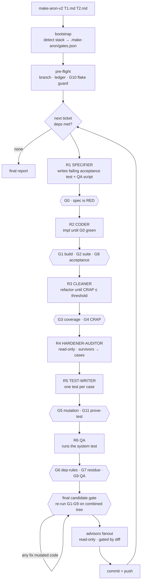

# Design: `make-aron-v2`

**Status:** draft for review. Nothing built yet.
**Supersedes:** `make-aron` (v1) for the implementation phase only. `make-plan-aron` unchanged, still the ticket source.
**Date:** 2026-08-23

---

## 1. Goal

One command. One arg. Ticket in → verified commit out, or hard stop with the exact failing gate.

```
make-aron-v2 <ticket.md> [ticket2.md ...]
make-aron-v2 ./artifacts/PLAN_2026_08_23_auth/     # dir → all T*.md, topo-sorted
```

Three properties v1 does not have:

- **P1. Self-contained.** No `ship`. No `AgentSystemLabs/core`. No skill-to-skill dependency outside `~/.agents/`.
- **P2. Deterministic gates.** Quality is decided by scripts that exit non-zero, not by an LLM reading code.
- **P3. One entry point.** No plan phase, no mode flags, no depth argument, no interactive step.

---

## 2. The thesis, stated so it can be argued with

v1 + `ship` compute **zero numbers**. Every quality judgment is a model reading a diff. That works — `ship` benchmarked 47.0/50 vs 43.2 plain prompting — but it degrades exactly the way Uncle Bob describes: rules in the middle of a long context lose attention weight, and a threshold written in prose (*"files >300 lines… a cohesive 400-line file is fine"*) is a threshold the agent negotiates with.

v2's bet: **move every rule that can be computed into a script, and keep the LLM only for what cannot be computed.**

Bob's formulation, which the whole design serves:

> The key with agents is to trim that initial prompt down to its absolute minimum so that you can get as much of it as possible into its priority — then do deterministic tools after the fact.

Consequence: `SKILL.md` for v2 should be **shorter** than v1's, not longer. If v2 ends up with more prose than v1, the design failed.

### 2.1 Honest tension

"No dependencies" cannot mean *no external tools*. The deterministic gates **are** external tools — `lizard`, a coverage reporter, a mutation engine. What v2 removes is **skill** dependencies (another agent's prose pipeline you don't control). What it adds is **binary** dependencies (versioned, offline, exit-code-typed). That trade is the entire point: a binary dependency cannot drift, cannot be argued with, and cannot silently reinterpret its own instructions.

---

## 3. What v2 absorbs, what it drops

### 3.1 Absorbed from `ship` (re-implemented, not vendored)

| Kept | Why | New home |
|---|---|---|
| Final candidate gate, **recursive** — *"a fix is not allowed to certify itself"* | best idea in ship | `G1`–`G9` re-run loop |
| Risk signals list (auth/pay/secrets/webhooks/migrations/jobs/multi-subsystem) | good, stable, cheap | `risk-signals.md`, drives thresholds not phases |
| Read-only reviewer subagents, findings contract, `auto-fixable` flag | real API, mechanically consumed | `roles/advisor.md` + `findings-contract.md` |
| `reviewer-test-quality` detectors A–F | **complementary to mutation, not replaced by it** — Detector F (defining invariant unasserted) catches what no mutator can | `roles/hardener-auditor.md` |
| `simplify` code-smell catalog | prose companion to CRAP | `references/code-smells.md` |
| Run ledger, base-SHA validated, survives compaction | fixes v1's discarded-evidence leak | merged into progress file |
| "NEVER declare done without running the new code path" | the one non-scriptable check that matters | `G9` QA |
| `headless` semantics — *removes questions, never gates* | v2 is headless by definition | default and only mode |

### 3.2 Dropped deliberately

| Dropped | Why |
|---|---|
| Intent classification (CREATE/EVOLVE/POLISH/REMOVE/FIX/AUDIT) | The ticket already says what to do. Classification exists for free-text goals; v2's input is a spec. |
| `mode=fast\|balanced\|production` | Depth-by-mode means gates get skipped. v2 runs **all** gates always; risk signals move *thresholds*, never remove a gate. |
| ~~Reduced reviewer fleet~~ | **Reversed on review — all advisors kept.** 15 reviewers + `findings-reconciler` + `integration-verifier` + `utility-finder` = 18, gated by diff content, run **after** deterministic gates pass. Cheap checks first, but nothing dropped. |
| `AskUserQuestion` anywhere | v2 has no interactive path. |
| Plan generation | `make-plan-aron` owns it. v2 takes tickets only. |
| v1's `blocker/should-fix/note` scale | Replaced by ship's `CRITICAL/HIGH/MEDIUM/LOW` + `auto-fixable`. One vocabulary. |

---

## 4. Pipeline

Five roles per ticket, each a fresh-context child, each dying after its report. Bob's ordering, with his hardener split in two to satisfy his own read-only-auditor rule.



### 4.1 Roles

| id | Role | Writes? | Sees | Trajectory |
|---|---|---|---|---|
| `R1` | specifier | tests + QA script only | ticket file | "encode the contract" |
| `R2` | coder | source | ticket + failing spec | "make it pass" |
| `R3` | cleaner | source | **CRAP report only** — not the mutation report | "reduce branching" |
| `R4` | hardener-auditor | **nothing** | mutation report + diff | "find unverified behaviour" |
| `R5` | test-writer | tests only | R4's plain-language case list | "assert the case" |
| `R6` | qa | nothing (runs) | QA script + running system | "does it actually work" |

`R3` and `R4/R5` must never share a context. Bob's reason, restated: the cleaner's goal is *fewer branches*; the cheapest way to kill a mutant is often to *add* a branch. One agent holding both goals oscillates or satisfies neither honestly.

`R4` cannot write. This is Bob's step-4 guardrail against the model deleting the mutable construct or writing an assertion on the mutated line and calling it a kill.

---

## 5. Gates

Every gate is a script in `gates/`. Contract:

```
gates/<name>.sh  [--json]
  stdin:  nothing
  stdout: human-readable findings, or JSON with --json
  exit 0: pass
  exit 1: fail (findings on stdout)
  exit 2: cannot run (tool missing, config missing) → hard stop, never "pass"
```

Exit 2 is load-bearing. A missing mutation engine must **not** read as a clean scan.

| id | Gate | Deterministic | Threshold | Blocks |
|---|---|---|---|---|
| `G0` | spec-red — acceptance test exists and **fails** | yes | exit 1 if it passes | coder starts |
| `G1` | build — typecheck + lint + build | yes | zero errors | everything |
| `G2` | suite — full test suite green | yes | zero failures | everything |
| `G3` | coverage — line coverage on **changed lines** | yes | `100` (Bob's stance, diff-scoped) | cleaner exit |
| `G4` | crap — CRAP per changed function | yes | `≤ 6`, `≤ 4` on risk-signal files | cleaner exit |
| `G5` | mutation — incremental, diff-scoped | yes | `score = 1.0` minus allowlist | hardener exit |
| `G6` | dep-rules — module layering | yes | zero violations | commit |
| `G7` | residue — secrets, merge markers, debug leftovers | yes | zero | commit |
| `G8` | acceptance — the `G0` test now passes | yes | pass | commit |
| `G9` | qa — executable system test | yes | pass | commit |
| `G10` | flake — suite run 2×, identical result | yes | identical | **run start** |
| `G11` | prove-test — each new test fails against reverted impl | yes | all fail | test-writer exit |

### 5.1 `G4` — CRAP

```
CRAP(m) = comp(m)² × (1 − cov(m))³ + comp(m)
```

Because `G3` pins diff coverage at 1.0 before `G4` runs, the first term is zero and **`CRAP = cyclomatic complexity`**. The score is a pure complexity dial, which is why 6 is the right number here and 30 (the published figure, for triaging legacy at partial coverage) is not.

Implementation: `lizard --csv` for complexity + lcov for coverage, joined by line range. ~40 lines of Python. Bob's advice applies — don't vendor his; point the agent at the formula and have it build ours.

**Upgrade over Bob's version:** once `G5` produces mutation data, feed *that* as the coverage term instead of lcov:

```
CRAP′(m) = comp(m)² × (1 − mutation_score(m))³ + comp(m)
```

Not a published standard. It is what CRAP was reaching for — complexity weighted by *verified* behaviour rather than *executed* lines. Same join by line range. Deferred to phase 3 (§9).

### 5.2 `G5` — mutation

Never full-project inside the loop. Diff-scoped + per-test coverage analysis → 10–50× reduction, which is what turns Bob's overnight run into minutes.

**Equivalent mutants are undecidable.** A `score = 1.0` gate is unsatisfiable without an escape valve, so:

```jsonc
// .make-aron/equivalent-mutants.json  — committed, reviewed like code
[
  {
    "file": "src/pricing.ts",
    "line": 42,
    "mutator": "EqualityOperator",
    "original": "i < 10",
    "mutated": "i != 10",
    "justification": "loop steps by 1 from 0; observationally identical",
    "added_by": "T4",
    "sha": "abc1234"
  }
]
```

Rules: an entry needs a prose justification; the auditor may **propose** entries but cannot write the file (it's read-only); the parent writes it after the entry survives one advisor pass. Growth of this file is the metric to watch — it is where the gate goes to die.

### 5.3 `G11` — prove-test

Bob names the failure mode ("agents write fake tests to kill mutants") but leaves the defense as prose. It is scriptable:

```
for each test added in this ticket:
  1. git stash the production hunks this ticket touched
  2. run only that test
  3. expect FAIL
  4. restore
  exit 1 on any test that passed against the reverted implementation
```

A test that passes without the implementation tests nothing. This turns Bob's strongest prose guardrail into an exit code, and it is the single most valuable script in the design.

### 5.4 `G6` — dep-rules

The fully-missing phase in both v1 and `ship`. `ship`'s `reviewer-dependencies` is supply-chain (npm audit, licenses, install scripts) — not module layering.

```jsonc
// .make-aron/layers.json
{
  "layers": ["domain", "application", "adapters", "ui"],
  "rules": [
    { "from": "domain",      "may_depend_on": [] },
    { "from": "application", "may_depend_on": ["domain"] },
    { "from": "adapters",    "may_depend_on": ["application", "domain"] },
    { "from": "ui",          "may_depend_on": ["application"] }
  ],
  "map": { "src/domain/**": "domain", "src/app/**": "application", "...": "..." }
}
```

Violation is not auto-fixable. Three legal repairs, all structural: invert the dependency, insert an interface, split the module. The gate states which files violate; a worker picks the repair.

Absent `layers.json` → `G6` exits 0 with `not configured` on stdout, and the final report says so. Silence is not a pass.

---

## 6. Config and bootstrap

Commands differ per stack. v2 never guesses at runtime — it resolves once, writes the resolution down, and reads the file thereafter.

```jsonc
// .make-aron/gates.json   — generated on first run, committed
{
  "version": 1,
  "stack": "node-ts",
  "detected_from": ["package.json", "vitest.config.ts", "tsconfig.json"],
  "cmd": {
    "typecheck": "npx tsc --noEmit",
    "lint":      "npx eslint . --max-warnings 0",
    "build":     "npm run build",
    "test":      "npx vitest run",
    "coverage":  "npx vitest run --coverage --coverage.reporter=lcov",
    "complexity":"lizard src/ --csv",
    "mutation":  "npx stryker run --since=main --reporters json"
  },
  "paths": { "lcov": "coverage/lcov.info", "mutation_json": "reports/mutation/mutation.json" },
  "thresholds": { "crap": 6, "crap_risk": 4, "coverage": 1.0, "mutation": 1.0, "max_file_lines": 400 },
  "determinism": { "TZ": "UTC", "seed_env": "SEED=0", "freeze_clock": true }
}
```

**Bootstrap** (first run only, no config present):
1. Detect stack from marker files.
2. Resolve each command; verify each by running it once.
3. Any command unresolvable → **exit 2, hard stop**, name the missing tool and the exact install command. Never proceed with a gate disabled.
4. Write the file, log an Assumption, continue.

Detection is evidence-based (the file exists, the command ran), so it is not a guess under `B1`.

### 6.1 Tool matrix

| Stack | complexity | coverage | mutation (incremental flag) |
|---|---|---|---|
| JS/TS | `lizard` or `eslint complexity` | vitest/jest lcov | Stryker `--since=main` |
| Python | `lizard` / `radon cc -j` | `pytest --cov-report=lcov` | mutmut `--paths-to-mutate $(git diff --name-only main)` |
| Go | `gocyclo` / `lizard` | `-coverprofile` + gcov2lcov | go-mutesting + diff file list |
| Rust | `lizard` | `cargo-llvm-cov --lcov` | **cargo-mutants `--in-diff`** — cleanest of the lot |
| Java | PMD / `lizard` | JaCoCo → lcov | PIT `--changedSinceLastCommit` |
| PHP | `lizard` | PHPUnit clover→lcov | Infection `--git-diff-filter=AM` |

`lizard` covers 12+ languages and is the default; native tools are opt-in overrides in `gates.json`.

---

## 7. Layering — where each check runs

Cost varies by three orders of magnitude, so placement does too.

| Layer | Runs | When | Consumer |
|---|---|---|---|
| **hook** | format + lint + typecheck, changed file only | every file write | coder, immediately, in its working set |
| **coder** | `G1` `G2` `G8` | end of R2 | coder loop |
| **cleaner** | `G3` `G4` + code-smell prose | end of R3 | cleaner loop |
| **hardener** | `G5` `G11` | end of R5 | test-writer loop |
| **commit** | `G6` `G7` `G9` + final candidate gate | before git | parent |
| **advisors** | LLM fanout, gated by diff | after all gates green | parent, findings ledger |
| **run start** | `G10` flake guard | once per invocation | parent — mutation on a flaky suite is noise |

The hook is not optional. It is the cheapest layer and the one `ship` expresses as prose ("after each file, run type-check") that agents forget. Implemented as a `PostToolUse` matcher on `Edit|Write` where the harness supports it; where it doesn't, the coder role carries the rule and `G1` catches the drift late.

**Advisors run last, not first.** Deterministic checks are cheap and cannot be argued with; run them while the code is cheap to change. LLM review is expensive and probabilistic; spend it on what's left. This inverts v1, where the LLM reviewer fanout was the *primary* quality mechanism.

Advisor set: all 18, in `advisors/`. Each read-only, one dimension, fresh context, hard-set model, `findings-contract.md` output. `CRITICAL`/`HIGH` → one fix worker. `MEDIUM`/`LOW` → logged, shipped. Dispatch matrix in `ADVISORS-FORMAT.md`. Four upstream subagents are not ported (`plan-red-team`, `crud-surface-mapper`, `ui-pattern-inspector`, `runtime-contract-tracer`) — all planning-phase tools, reasons recorded in that same file.

---

## 8. Loop control

Bob's loop is *"change the code until this tool says it's okay"* — unbounded, because a deterministic gate is always eventually satisfiable. Mostly true, except `G5` (equivalent mutants) and `G4` (a genuinely irreducible function). So: bounded, with the bound visible.

| id | Budget | On exhaustion |
|---|---|---|
| `B1` | `G0`–`G2` — 3 attempts per role | `blocked` + last gate output verbatim |
| `B2` | `G4` cleaner — 5 attempts | `blocked`, report the function + its CC |
| `B3` | `G5` hardener — 3 rounds of (audit → write → re-run) | `blocked`, list survivors + proposed equivalents |
| `B4` | final candidate gate — 3 recursions | `blocked`, the pipeline is oscillating; that is a finding |
| `B5` | advisors — 1 fix pass, `CRITICAL`/`HIGH` only | rest logged as residual risk |

Every budget exhaustion is a **hard stop with a one-line next human action**, not a silent downgrade. Terminal states per ticket: `done | blocked_gate:<id> | blocked_user | blocked_dep`.

**Anti-Goodhart, non-scriptable, carried as prose in the cleaner role** (Bob's second failure mode — complexity limits cause function shredding into meaningless helpers):

- extracted function must be nameable without "and"
- `max_file_lines` capped so shredding isn't free
- helper used exactly once and named after its call site → not an extraction, revert it

---

## 9. Delivery phases

Build in this order; each phase is independently useful and independently abandonable.

| Phase | Contents | Unblocks |
|---|---|---|
| **1** | CLI + arg parse, topo-sort, bootstrap, ledger, `G1` `G2` `G7` `G8` `G10`, coder role, git layer | replaces v1 minus quality gates |
| **2** | hook layer, `G3` `G4`, cleaner role, code-smells reference | the CLEANER phase |
| **3** | `G5` `G11`, hardener-auditor + test-writer roles, equivalent-mutant allowlist | the HARDENER phase — the expensive one |
| **4** | `G0` `G9`, specifier + qa roles | executable spec + executable system test |
| **5** | `G6` layers.json, advisor fanout, `CRAP′` mutation-weighted score | architecture + the LLM layer back on top |

Phase 3 is the risk. If mutation tooling for the target stack is bad, phases 1/2/4/5 still ship and `G5` stays a no-op that reports `not configured` — loudly.

---

## 10. Layout

```
~/.agents/skills/make-aron-v2/
  SKILL.md                    # thin. routing + loop + budgets. target < 120 lines
  gates.md                    # gate contract, exit codes, threshold rationale
  references/
    code-smells.md            # cleaner's prose companion to CRAP
    risk-signals.md           # auth/pay/migrate/webhook/jobs/multi-subsystem
    findings-contract.md      # CRITICAL/HIGH/MEDIUM/LOW + auto-fixable
  gates/
    crap.py  mutation.sh  prove-test.sh  deprules.py
    coverage.sh  residue.sh  flake.sh  build.sh  suite.sh  qa.sh
  bootstrap/
    detect.py                 # stack → gates.json
~/.agents/roles/
  specifier.md  coder.md  cleaner.md  hardener-auditor.md  test-writer.md  qa.md  advisor.md
<project>/.make-aron/
  gates.json  layers.json  equivalent-mutants.json  runs/<run-id>.md
```

`.make-aron/` is **committed**, not scratch. Thresholds, layer rules, and the equivalent-mutant allowlist are project decisions with the same review weight as source. Only `runs/` is ignored.

---

## 11. Success criteria

- `S1` — `make-aron-v2 T1.md` on a clean repo produces a pushed commit, or a hard stop naming one gate id.
- `S2` — every threshold in the pipeline is a number in `gates.json`, reachable by `grep`. Zero numeric thresholds in prose.
- `S3` — deleting any `gates/*.sh` makes the run **fail** (exit 2), never quietly pass.
- `S4` — `SKILL.md` is shorter than v1's `SKILL.md`. If not, the design failed §2.
- `S5` — a deliberately assertion-free test added by hand is caught by `G11`, not by an advisor.
- `S6` — the final report prints, per ticket: gate id → pass/fail → exact command → exact output.

---

## 12. Open risks

- `R1` — **Multi-language burden.** Every gate needs a per-stack incantation. `lizard` covers complexity broadly; mutation does not. Mitigation: `gates.json` is per-project and written once; unresolvable → exit 2, no silent degradation.
- `R2` — **Cost.** Bob's own open question: *"there must be a point where too many checks slow the agents below human speed, at which point you've lost the game."* He hasn't found it and is still adding tools. v2 is more gates than he runs, on top of a stack already costing +81% tokens. **Measure wall-clock-to-merged-commit from phase 1 onward** or this is unfalsifiable.
- `R3` — **`equivalent-mutants.json` becomes a dumping ground.** Growth rate is the health metric. Consider a cap: N entries per ticket, exceeded → blocked.
- `R4` — **`G3` at 100% diff coverage** is right for fresh commit-sized slices (which tickets are, by `make-plan-aron`'s contract) and wrong for anything else. Never point it at the whole project.
- `R5` — **CRAP 6 is Bob's number, and he admits he argued it with the agents themselves** — *"you can't trust a debate with an agent."* Treat 6 as a starting point in `gates.json`, tune toward 8, and log what you changed and why.
- `R6` — ~~Losing advisor depth.~~ **Closed.** All 18 advisors ported; a11y, loading states, observability, client bundle and error boundaries are covered. Residual: 18 read-only children per ticket on top of the gauntlet is the dominant token cost — the dispatch matrix gating them by diff content is what keeps it bounded, so a matrix that fires everything on every ticket silently reintroduces the cost.
- `R7` — **No benchmark.** `ship` shipped a 3-arm controlled benchmark with a limitations section. v2 replaces a measured component with an unmeasured one. Re-run the same shape — v2 vs v1+ship on identical briefs — before trusting the swap.
- `R8` — **`G10` flake guard fails on most real suites.** Two identical runs is a low bar that many projects still miss. Expect the first invocation on an existing codebase to hard-stop here. That is correct behaviour and will feel like a bug.

---

## 13. Decisions taken (log these, don't re-litigate)

- `A1` — No plan phase in v2. Tickets are input. `make-plan-aron` stays as-is.
- `A2` — No modes. All gates always. Risk signals move thresholds only.
- `A3` — Headless by definition. No `AskUserQuestion` path exists.
- `A4` — Gates block; advisors advise. Only `CRITICAL`/`HIGH` advisor findings earn a fix pass.
- `A5` — `.make-aron/` is committed. Thresholds are code.
- `A6` — Exit 2 ≠ exit 0. A gate that cannot run stops the pipeline.
- `A7` — Cleaner before hardener, always, separate contexts. No exceptions, including the tail.
- `A8` — v1 stays installed until v2 reaches phase 4. They do not share state.
