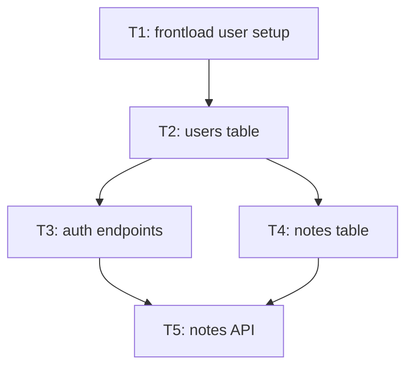

# make-plan-aron

Take goal in -> 1 markdown plan, 1 html plan, X ADR Records

## Pre-flight

If not already, read :
`~/.agents/skills/caveman/SKILL.md`

Lazy — read only when needed :

`~/.agents/skills/_shared/ADR.md`

## Job

### 1 - Grill Session

Parse goal.
Make scope clear.
Ambiguity → run `~/.agents/skills/grill-me-aron/SKILL.md`.
Target level 5 spec understanding.

### 2 - Tickets Planning

Decompose goal into tickets.
Specify ticket dependancies from predecessors tickets and validation criteria.
Paralellize tickets if possible.
Generate Mermaid relation graph expliciting implementation flow.

Output :

1. Save `./artifacts/PLAN_{YYYY_MM_DD}_{title}.md`.
   Is Index. Holds **no ticket body** — only links.

````md
# Title

{1 sentence description}

## Tickets Flow



## Index

| Ticket ID | Goal               | State       | Link            |
| --------- | ------------------ | ----------- | --------------- |
| T1        | {1 short sentence} | COMPLETE    | {obsidian link} |
| T2        | ...                | IN-PROGRESS | ...             |
| T3        | ...                | NOT STARTED | ...             |
````

## 3 — Plan Red-team (fresh context, read-only, index-level)

If plan is 6 tickets or less -> SKIP to step 4.

Spawn reviewer **read-only** subagent: `~/.agents/roles/reviewer.md.`
Model = fable. Thinking = high.

Dimension `plan-red-team` + target = index + repo root.
Hand it:

- index
- goal + success def
- Scope In / Out, assumptions
- locked user decisions
- every repo fact you already found.

If missing input → reports as coverage gap. **Do not invent**.

On return, arbitrate for each ticket reviewer report :

- `KILL` / `MERGE` → delete or fold the row, fix `Depends` on every row pointing at it, redraw the flowchart.
- `AMEND` → patch the row. Ordering amendment → re-topo-sort.
- `BLOCKED` → user-owned decision.
- `UNVERIFIED` that cannot change the decomposition → log under `## Assumptions`, proceed.

Update PLAN accordingly.

### 4 - Ticket Writing

Writes each ticket as `./artifacts/PLAN_{YYYY_MM_DD}_{title}/T{n}_{ticket-slug}.md` with spec level 5 detail.

**Ticket file template**

```md
# T{n}: {title}

**Plan:** `./artifacts/PLAN_{YYYY_MM_DD}_{title}.md`  
**Depends:** T? / none  
**Commit outcome:** {one sentence — what works after commit}

## Context (self-contained)

- Goal: {plan goal, 1-2 sentences — restated, not linked}
- This slice: {where it sits in the whole}
- Out of scope here: {fence — what worker must not touch}
- Assumptions in force: {the ones this ticket depends on}

## Requirements

- ...

## Inputs

- files / APIs / state to read
- **From Depends:** {exact paths + API names + behavior predecessor left. Spell them out — worker cannot read T{n-1}}

## Interface contract (level 5)

Machine-checkable shapes this slice produces or consumes. Verbatim, copy-pasteable. No prose paraphrase.

- **Produces:** {type sigs / fn sigs / class shape / route + method + request schema + response schema + status codes / JSON Schema / protobuf / SQL DDL + migration name / CLI flags / env vars + defaults}
- **Consumes:** {same, verbatim as the predecessor produced it — binding, do not redesign}
- **Errors:** {exact type / code / message per failure path}
- **Invariants:** {pre/post conditions, nullability, ordering, idempotency, units}
- **Integration links** (only if this slice crosses a process / host / library boundary): trigger `{path:line}` → dispatch `{exact endpoint / channel / queue / file path + auth + env}` → receive `{handler + payload validation}` → observe `{DB row / log line / cache invalidation / external resource}`. Link not locatable → `MISSING`, never guessed. No observe link → this ticket's done is unprovable; add one.

## TDD

1. **Red** — write failing test(s) first.
2. **Green** — min code pass test.
3. **Refactor** — only if needed. Keep green.

## Test plan

| Test | Input | Expect |
| ---- | ----- | ------ |
| ...  | ...   | ...    |

## Impl steps

- [ ] 1.
  - [ ] 1.1
  - [ ] 1.2 ...
- [ ] 2.
  - [ ] 2.1 ...

## Validation

- [ ] tests pass (list cmds)
- [ ] manual check (if UI/CLI)
- [ ] no silent-failure swallow on a path this slice adds — `|| true`, empty catch, `>/dev/null 2>&1`, fire-and-forget with no error path. List each site kept + why, or `none`
- [ ] app functional — no broken path from this slice
- [ ] commit msg draft: `{type}({scope}): {why}`
```

## 5 - Coherence Review

Spawn **reviewer subagent**.
Analyse ticket flow coherence : Matching validation criteria of ticket for follow up ticket.
Report findings. You arbitrate.

## 6 - Recording ADR

Read `~/.agents/skills/_shared/ADR.md`.
Write **X ADR Records markdown doc**. Caveman Lite. Save `./docs/ADR/XXX_ADR_{title}.md`.

## Spec level

| Lvl   | Name                      |
| ----- | ------------------------- |
| 0     | intent                    |
| 1     | brief                     |
| 2     | PRD / acceptance criteria |
| 3     | functional spec           |
| 4     | tech design (RFC/ADR)     |
| **5** | **interface contract**    |
| 6     | executable spec (tests)   |
| 7     | formal spec               |
| 8     | the code itself           |

## Rules

- First ticket **must frontload** every user interactions (e.g. package installation, account creation, linking API key, etc...).
- **TDD mandatory** each ticket. No "test later".
- Prefer vertical slice over layer cake (no "all models then all UI").
- Paths, cmds, API names = exact. No fluff.
- Ref existing specs/ADRs by path. No dupe.
